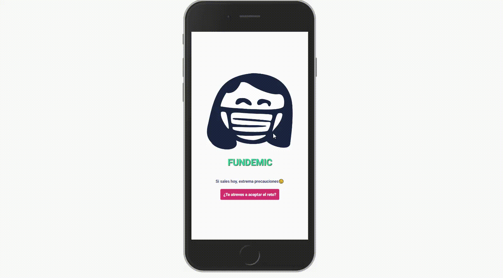

# Hacking for Humanity project

¡Hola! Somos **console.mio**, un equipo formado por [Bárbara B. Sacristán](https://www.linkedin.com/in/barbarabsacristan/), [Jesús Martínez](https://www.linkedin.com/in/susomartinez/), [María Ozámiz](https://www.linkedin.com/in/mariaozamiz/), [María Segura](https://www.linkedin.com/in/seguramaria/) y [Pablo Cabezas](https://www.linkedin.com/in/headsrooms/). Venimos de ámbitos tan distintos como la ingeniería, la educación, el arte y la educación social. Este es nuestro primer hackathon y queremos aportar nuestro granito de arena para mejorar la vida de las personas afectadas por el COVID-19.

# ¡Empezamos!

---

Dedicamos la noche del martes a intercambiar experiencias e impresiones sobre el COVID-19, la "nueva normalidad" y las diferencias entre la situación actual y la de primera ola. ¿Cuánto nos ha tocado personalmente? ¿Y en lo profesional? ¿Cómo ha afectado la pandemia a nuestras familias, barrios, ciudades?

Aunque todes estamos atravesando la pandemia por COVID-19, la experimentamos y vivimos de manera diferente, por lo que las **reacciones psicológicas y experiencias emocionales** son muy distintas. Un estudio reciente del Consejo General de la Psicología de España advierte que el 40% de población española refiere **síntomas de depresión y problemas de ansiedad** vinculados a la crisis sanitaria actual.

Estos datos nos parecieron motivo suficiente para crear un proyecto basado en el **bienestar emocional** de la población. Creemos que **no hay impacto pequeño** y que nuestra intervención podría mejorar la vida de las personas afectadas facilitándoles recursos que ya existen de una manera sintétizada, organizada y gamificada. Nuestro bienestar individual, sin duda repercute en la convivencia y esperamos que esta iniciativa aporte su **huella positiva** tanto en lo personal como en el ámbito de lo público.

---

# Prototipado

Estamos construyendo una **web App** que ofrece a las personas usuarias retos relacionados con el bienestar emocional. La aplicación tiene una **función de localización** y **recoge datos relativos a la incidencia del COVID-19**, para ofrecerte actividades y alternativas seguras dependiendo del nivel de incidencia en tu ciudad.

### 🎯 Objetivos

---

- Proponer retos a las personas usuarias para recuperar parcelas de bienestar
- Proponer alternativas seguras al ocio tradicional
- Prolongar el bienestar a las comunidades que rodean a las personas usuarias, fomentar la ayuda y participación ciudadana

### 🧗‍♀️ Retos

---

- Incluir los datos de la incidencia del virus como un factor para aconsejar o desaconsejar determinadas actividades
- Definir los retos de forma inclusiva y con alternativas adaptadas.
- Gamificar las propuestas para generar mayor compromiso con las pautas y darle una dimensión social a la experiencia

### 🧰 Tecnologías utilizadas

---

- HTML y CSS (SASS)
- React
- Python
- DataSet aportado

# Funcionalidades

Web app creado con React y Backend en Python.

Las personas usuarias acceden a la página y encuentran un listado de retos en los que pueden elegir cuáles aceptar.
Tras aceptarlos, se añaden a su listado de retos y pueden compartir sus avances en Twitter.

Puedes ver nuestra página aquí: https://bit.ly/fundemic

